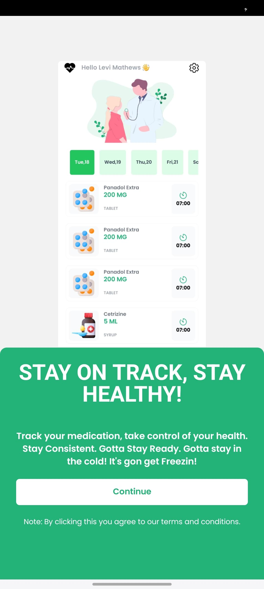
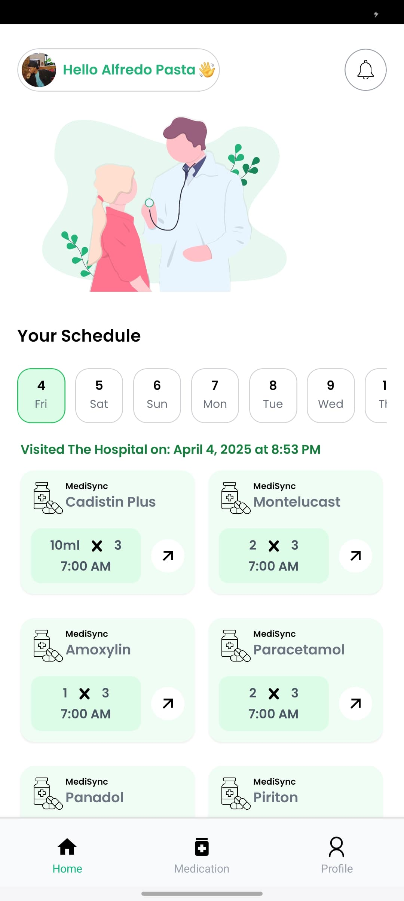
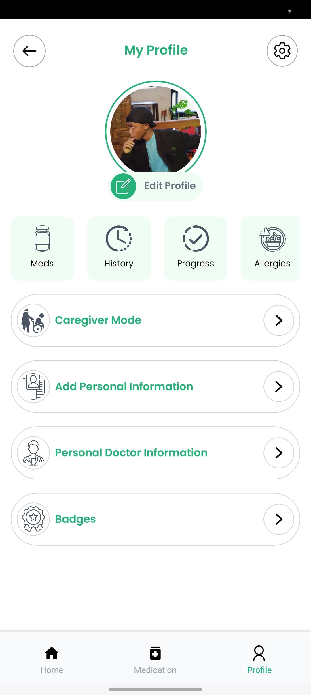

# MediSync 📱💊

MediSync is a mobile app designed to help users manage their medications efficiently. It provides reminders, medication tracking, and an intuitive interface for a seamless experience.

## ✨ Features

- 📅 **Medication Schedule** – View your upcoming doses in an interactive calendar.
- 🔔 **Reminders & Notifications** – Never miss a dose with timely alerts.
- 📊 **Prescription History** – Keep track of past medications.
- 📡 **Cloud Sync** – Data is securely stored with Firebase.
- 👨‍⚕️ **User Authentication** – Secure login system with Firebase Auth.
- 🎨 **Modern UI** – Built with Tailwind CSS for a sleek and user-friendly experience.

## 🛠 Tech Stack

- ⚛ **React Native with Expo** – Cross-platform mobile development.
- 🎨 **Tailwind CSS** – For beautiful and responsive UI styling.
- 🔥 **Firebase** – Authentication, Firestore for database, and Realtime Database for instant updates.

## 🚀 Getting Started

### Prerequisites

Ensure you have the following installed:

- [Node.js](https://nodejs.org/)
- [Expo CLI](https://docs.expo.dev/get-started/installation/)
- Firebase setup with a project

### Installation

1. Clone the repository:

   ```sh
   git clone https://github.com/math3wsl3vi/medi-sync.git
   cd medisync
   ```

2. Install dependencies:

   ```sh
   npm install
   ```

3. Create a **.env** file and add your Firebase credentials:

   ```sh
   FIREBASE_API_KEY=your_api_key
   FIREBASE_AUTH_DOMAIN=your_auth_domain
   FIREBASE_PROJECT_ID=your_project_id
   FIREBASE_STORAGE_BUCKET=your_storage_bucket
   FIREBASE_MESSAGING_SENDER_ID=your_messaging_sender_id
   FIREBASE_APP_ID=your_app_id
   ```

4. Start the app:

   ```sh
   npm start
   ```

## 📸 Screenshots

### Intro Screen


### Home Screen


### Profile


## 📜 License

This project is licensed under the MIT License.

---

Made with ❤️ by Master Bruce & Contributors

